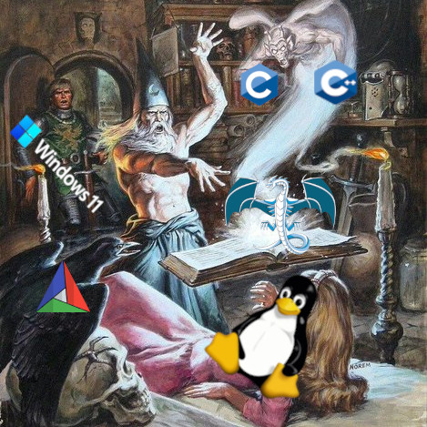

<table>
<tr>
<td width="260" valign="top">



<sub><i>art by <a href="https://en.wikipedia.org/wiki/Earl_Norem">Earl Norem</a></i></sub>

</td>
<td valign="top">

```
| UnsignedChad@github
|
| status       EE/CpE undergrad. dropped out. going back to FSU fall 2026.
| focus        open source, circuits, power systems, electronics, FPGA
| building     circuitcore (PI/SI/EMI for KiCad), VHDL-in-the-browser
| stack        C/C++23, MATLAB, VHDL, CMake, Linux, Bash
| workflow     small atomic commits, fast iteration, tests on the hot paths
| funding      drowning in college debt. github.com/sponsors/UnsignedChad
```

</td>
</tr>
</table>

### oss work

- **[circuitcore](https://github.com/UnsignedChad/circuitcore)** -- PCB analysis toolkit. pdnkit (power integrity), sikit (signal integrity), emikit (EMI / radiated emissions). C++23, Qt6, Eigen, SuiteSparse. one shared board model parsed from `.kicad_pcb`.
- **[ghdl-wasm](https://github.com/UnsignedChad/ghdl-wasm)** / **[ghdl-browser](https://github.com/UnsignedChad/ghdl-browser)** -- GHDL compiled to WebAssembly so VHDL can run in a browser.
- **[nvc-wasm](https://github.com/UnsignedChad/nvc-wasm)** -- NVC (alternative open-source VHDL compiler) ported to WebAssembly.
- **[FPGA_Webserver](https://github.com/UnsignedChad/FPGA_Webserver)** -- completing hamsternz's abandoned VHDL web server. target: Arty A7-35T.
- **[nickg/nvc](https://github.com/nickg/nvc)** -- merged [#1549](https://github.com/nickg/nvc/pull/1549) into NVC (VHDL compiler & simulator). fixed function signature mismatches in the JIT foreign-call interface; killed UB that broke sanitizers and WASM builds.

### academic

- FSU Honors profile -- [honors.fsu.edu/charles-kennedy](https://honors.fsu.edu/charles-kennedy)
- FSU CAPS (Center for Advanced Power Systems) personnel -- [caps.fsu.edu/.../charles-kennedy](https://www.caps.fsu.edu/about-caps/caps-personnel/charles-kennedy/)
- Georgia Tech ITAC (Industrial Assessment Center) student -- [itac.university/center/georgia-institute-of-technology](https://itac.university/center/georgia-institute-of-technology#students)
- MATLAB Central -- [mathworks.com/matlabcentral/profile/authors/10876168](https://www.mathworks.com/matlabcentral/profile/authors/10876168)

### what i enjoy


### github

<p>
  
</p>

<p>
  
</p>
